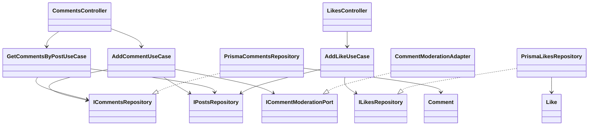
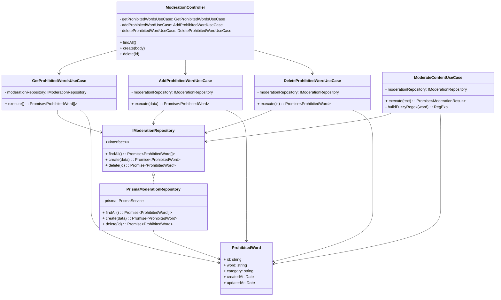
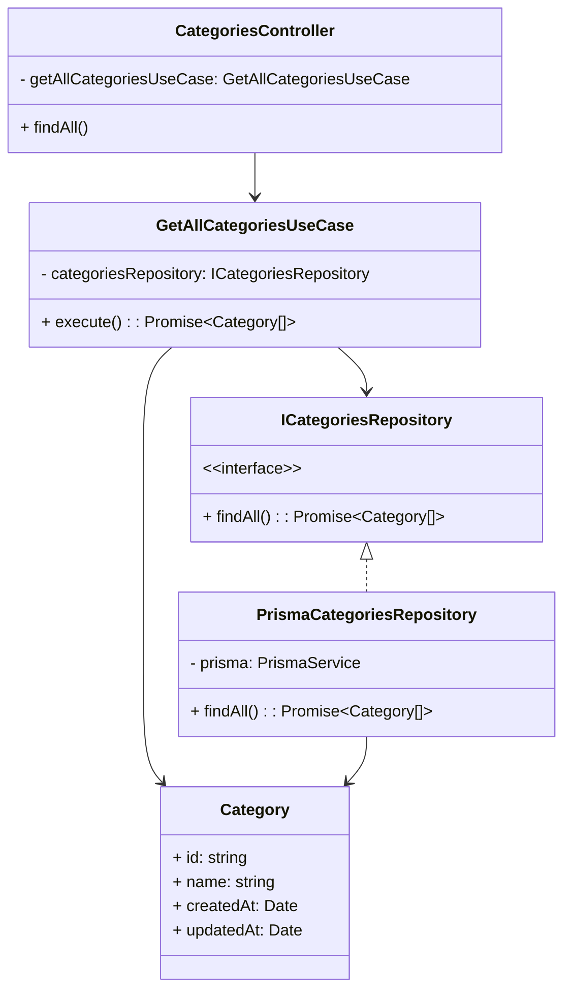
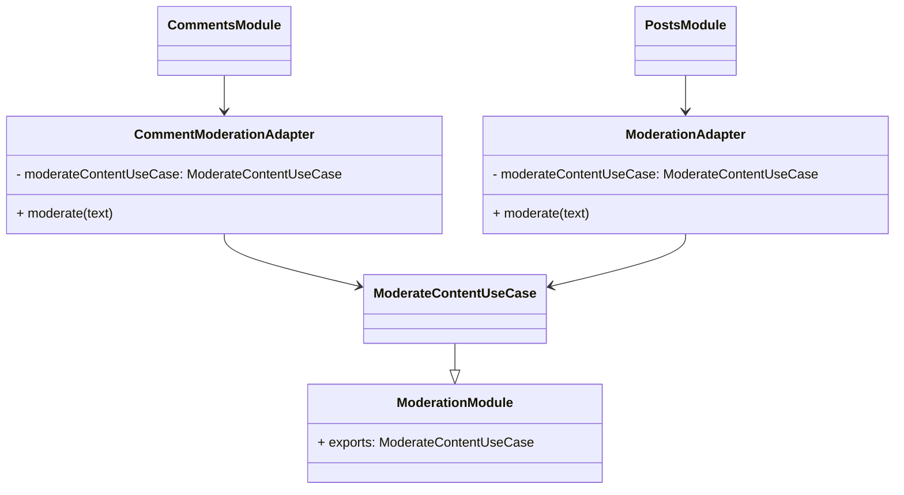

# Refactorización a Clean Architecture

## Problemas Identificados
Al analizar el código original, se detectaron las siguientes falencias relacionadas con el diseño de software y arquitectura:

1. **Alto Acoplamiento con el Framework y la Infraestructura:** El `PostsService` original estaba fuertemente acoplado a `PrismaService`. Mezclaba la lógica de negocio (como el mecanismo de estrategias de ranking del *feed*) con las consultas y el acceso a los datos.
2. **Falta de Límites Arquitectónicos Definidos:** Módulos que deberían ser adyacentes o separados (como `Likes` y `Comments`) inyectaban directamente dependencias de servicios implementados correspondientes a otras capas (`PostsService`). 
3. **Violación del Principio de Responsabilidad Única (SRP):** Un único servicio centralizado administraba demasiadas responsabilidades simultáneas: la creación de posts, la orquestación para llamar servicios externos de moderación y toda la lógica para manipular el feed.

---

## Solución Aplicada (Avance 1 - Módulo `Posts`)

Para esta primera fase, diseñamos una división vertical del trabajo y atacamos el **Core de Publicaciones** aplicando Clean Architecture. Se definieron las 4 capas base de este patrón:

- **Dominio (`domain/`)**: 
  - Se definieron y aislaron entidades puras de negocio: `Post` y `FeedPost`. Éstas no tienen anotaciones del framework ni importaciones de base de datos.
  - La lógica de ranking (Estrategias *Latest*, *MostLiked*, *MostCommented*, *Relevance*) fue convertida en código de negocio puro dentro de `feed-ranking.strategy.ts`.
- **Aplicación (`application/`)**:
  - **Casos de Uso (Use Cases):** Se dividió la funcionalidad del servicio monolítico en 3 casos de uso (`CreatePostUseCase`, `GetAllPostsUseCase`, `GetFeedUseCase`).
  - **Puertos (Ports):** Usando el **Principio de Inversión de Dependencias (DIP)**, se declararon interfaces base sobre cómo nuestra aplicación deberá conectarse al mundo externo: `IPostsRepository` y `IModerationPort`.
- **Infraestructura (`infrastructure/`)**:
  - `PrismaPostsRepository` implementa `IPostsRepository` empleando a Prisma para realizar persistencia y retornar las Entidades puras definidas en el dominio.
  - `ModerationAdapter` implementa `IModerationPort` para invocar al servicio aislado de moderación.
- **Presentación (`posts.controller.ts`)**: Su labor central ahora se reduce a inyectar únicamente Casos de Uso desde la capa de Aplicación y retornar los HTTP payloads correspondientes.

### Cambios Secundarios Transversales
Para preservar el correcto funcionamiento del resto de la aplicación, los módulos de funcionalidades sociales como `Likes` y `Comments` eliminaron su importación destructiva al viejo `PostsService`. A cambio de ello, ahora emplean *Tokens de Inyección* hacia `IPostsRepository`, permitiendo mantener un buen enrutamiento.

### Próximos pasos
El resto del equipo se encargará de realizar este mismo nivel de aislamiento para los Dominios restantes (`Likes`, `Comments`, `Moderation` y `Categories`).
---

## Solucion Aplicada (Avance 2 - `Comments` y `Likes`)

### Problemas Identificados
En los modulos de interaccion social se encontraron problemas similares a los del modulo `Posts`:

1. **Dependencia directa con Prisma:** `CommentsService` y `LikesService` dependian de `PrismaService`, por lo que la logica de aplicacion estaba mezclada con infraestructura.
2. **Reglas de negocio dentro de servicios acoplados:** La validacion de existencia del post, la moderacion de comentarios y los valores por defecto de likes estaban concentrados en servicios NestJS.
3. **Ausencia de puertos propios:** No existian interfaces para abstraer la persistencia de comentarios y likes, dificultando cambios de base de datos o pruebas unitarias aisladas.
4. **Controladores sin casos de uso:** Los controladores delegaban a servicios que hacian demasiadas cosas, en vez de orquestar casos de uso concretos.

### Solucion Implementada
Se refactorizaron `comments` y `likes` siguiendo las cuatro capas de Clean Architecture:

- **Dominio (`domain/`)**:
  - `Comment` y `Like` son entidades puras, sin dependencias de NestJS ni Prisma.
- **Aplicacion (`application/`)**:
  - `AddCommentUseCase`: valida que el post exista, modera el contenido y crea el comentario.
  - `GetCommentsByPostUseCase`: valida que el post exista y lista sus comentarios.
  - `AddLikeUseCase`: valida que el post exista, aplica valores por defecto (`reactionType = "like"`, `weight = 1`) y protege la regla de peso minimo.
  - `ICommentsRepository`, `ILikesRepository` e `ICommentModerationPort` definen los contratos que la aplicacion necesita.
- **Infraestructura (`infrastructure/`)**:
  - `PrismaCommentsRepository` y `PrismaLikesRepository` implementan los puertos usando Prisma.
  - `CommentModerationAdapter` adapta el servicio de moderacion existente al puerto requerido por comments.
- **Presentacion (`*.controller.ts`)**:
  - `CommentsController` y `LikesController` ahora invocan casos de uso directamente y mantienen los mismos contratos HTTP.

Los servicios `CommentsService` y `LikesService` quedaron como fachadas desacopladas, sin dependencia directa a `PrismaService`, para preservar compatibilidad si otro modulo los importa.

### Diagrama Resumido



### Codigo Resumido

```ts
export class AddLikeUseCase {
    async execute(data: { postId: string; reactionType?: string; weight?: number }) {
        const post = await this.postsRepository.findById(data.postId)
        if (!post) throw new NotFoundException("Post no encontrado")

        const weight = data.weight ?? 1
        if (weight < 1) throw new BadRequestException("El peso debe ser al menos 1")

        return this.likesRepository.create({
            postId: data.postId,
            reactionType: data.reactionType ?? "like",
            weight,
            source: "likes-module",
        })
    }
}
```

---

## Solución Aplicada (Avance 3 - Módulos `Moderation` y `Categories`)

### Problemas Identificados en `Moderation`

1. **Acoplamiento directo a PrismaService:** El `ModerationService` estaba completamente acoplado a Prisma, imposibilitando cambios en la persistencia sin tocar la lógica de negocio.
2. **Lógica de negocio en servicios de infraestructura:** La función `buildFuzzyRegex()` y toda la lógica de moderación (`moderate()`) estaban mezcladas con operaciones de BD.
3. **Ausencia de inversión de dependencias:** No existían interfaces para los repositorios, dificultando tests y cambios futuros.
4. **Falta de entidades de dominio:** No había representación pura de `ProhibitedWord`.
5. **Reutilización restringida:** El método `moderate()` se duplicaba en múltiples contextos sin un punto central.

### Problemas Identificados en `Categories`

1. **Servicio trivial acoplado a Prisma:** `CategoriesService` era apenas un wrapper sobre Prisma sin lógica de negocio propia.
2. **Ausencia de abstracción:** No había interfaz de repositorio, por lo que cambiar la persistencia requeriría cambios en múltiples lugares.
3. **Falta de estructura consistente:** No seguía el patrón de Clean Architecture aplicado a otros módulos.
4. **Ausencia de entidades de dominio:** No había clase `Category` que representara la entidad pura.

### Solución Implementada

Se refactorizaron ambos módulos aplicando las 4 capas de Clean Architecture:

#### Capa de Dominio

**`moderation/domain/prohibited-word.entity.ts`**
```typescript
export class ProhibitedWord {
    constructor(
        public id: string,
        public word: string,
        public category: string,
        public createdAt: Date,
        public updatedAt: Date,
    ) {}
}
```

**`categories/domain/category.entity.ts`**
```typescript
export class Category {
    constructor(
        public id: string,
        public name: string,
        public createdAt: Date,
        public updatedAt: Date,
    ) {}
}
```

✅ **Beneficios:** Código puro, desacoplado de frameworks y BD.

#### Capa de Aplicación - Puertos (Interfaces)

**`moderation/application/ports/moderation.repository.interface.ts`**
```typescript
export const I_MODERATION_REPOSITORY = "IModerationRepository"

export interface IModerationRepository {
    findAll(): Promise<ProhibitedWord[]>
    create(data: { word: string; category: string }): Promise<ProhibitedWord>
    delete(id: string): Promise<ProhibitedWord>
}
```

**`categories/application/ports/categories.repository.interface.ts`**
```typescript
export const I_CATEGORIES_REPOSITORY = "ICategoriesRepository"

export interface ICategoriesRepository {
    findAll(): Promise<Category[]>
}
```

✅ **Beneficios:** Inversión de dependencias, testabilidad mejorada, flexibilidad en la implementación.

#### Capa de Aplicación - Casos de Uso

**Moderation Use Cases:**

```typescript
// get-prohibited-words.use-case.ts
@Injectable()
export class GetProhibitedWordsUseCase {
    constructor(
        @Inject(I_MODERATION_REPOSITORY)
        private readonly moderationRepository: IModerationRepository,
    ) {}

    async execute(): Promise<ProhibitedWord[]> {
        return this.moderationRepository.findAll()
    }
}

// add-prohibited-word.use-case.ts
@Injectable()
export class AddProhibitedWordUseCase {
    constructor(
        @Inject(I_MODERATION_REPOSITORY)
        private readonly moderationRepository: IModerationRepository,
    ) {}

    async execute(data: { word: string; category: string }): Promise<ProhibitedWord> {
        return this.moderationRepository.create(data)
    }
}

// delete-prohibited-word.use-case.ts
@Injectable()
export class DeleteProhibitedWordUseCase {
    constructor(
        @Inject(I_MODERATION_REPOSITORY)
        private readonly moderationRepository: IModerationRepository,
    ) {}

    async execute(id: string): Promise<ProhibitedWord> {
        return this.moderationRepository.delete(id)
    }
}

// moderate-content.use-case.ts (Lógica de negocio pura)
@Injectable()
export class ModerateContentUseCase {
    constructor(
        @Inject(I_MODERATION_REPOSITORY)
        private readonly moderationRepository: IModerationRepository,
    ) {}

    async execute(text: string): Promise<ModerationResult> {
        const prohibitedWords = await this.moderationRepository.findAll()

        for (const pw of prohibitedWords) {
            const regex = this.buildFuzzyRegex(pw.word)
            if (regex.test(text)) {
                return {
                    approved: false,
                    reason: `Contiene palabra prohibida: "${pw.word}"`,
                    category: pw.category,
                }
            }
        }

        return { approved: true }
    }

    private buildFuzzyRegex(word: string): RegExp {
        const escaped = word.replace(/[.*+?^${}()|[\]\\]/g, "\\$&")
        return new RegExp(escaped.split("").join("[^a-zA-Z0-9]*"), "gi")
    }
}
```

**Categories Use Cases:**

```typescript
// get-all-categories.use-case.ts
@Injectable()
export class GetAllCategoriesUseCase {
    constructor(
        @Inject(I_CATEGORIES_REPOSITORY)
        private readonly categoriesRepository: ICategoriesRepository,
    ) {}

    async execute(): Promise<Category[]> {
        return this.categoriesRepository.findAll()
    }
}
```

✅ **Beneficios:** Cada caso de uso tiene una responsabilidad única, la lógica de negocio es clara y centralizada.

#### Capa de Infraestructura

**`moderation/infrastructure/prisma-moderation.repository.ts`**
```typescript
@Injectable()
export class PrismaModerationRepository implements IModerationRepository {
    constructor(private readonly prisma: PrismaService) {}

    async findAll(): Promise<ProhibitedWord[]> {
        const words = await this.prisma.prohibitedWord.findMany({
            orderBy: { createdAt: "desc" },
        })
        return words.map(w => new ProhibitedWord(w.id, w.word, w.category, w.createdAt, w.updatedAt))
    }

    async create(data: { word: string; category: string }): Promise<ProhibitedWord> {
        const word = await this.prisma.prohibitedWord.create({ data })
        return new ProhibitedWord(word.id, word.word, word.category, word.createdAt, word.updatedAt)
    }

    async delete(id: string): Promise<ProhibitedWord> {
        try {
            const word = await this.prisma.prohibitedWord.delete({ where: { id } })
            return new ProhibitedWord(word.id, word.word, word.category, word.createdAt, word.updatedAt)
        } catch (err: unknown) {
            if (err instanceof Error && "code" in err && (err as { code: string }).code === "P2025") {
                throw new NotFoundException("Palabra prohibida no encontrada")
            }
            throw err
        }
    }
}
```

**`categories/infrastructure/prisma-categories.repository.ts`**
```typescript
@Injectable()
export class PrismaCategoriesRepository implements ICategoriesRepository {
    constructor(private readonly prisma: PrismaService) {}

    async findAll(): Promise<Category[]> {
        const categories = await this.prisma.category.findMany({
            orderBy: { name: "asc" },
        })
        return categories.map(c => new Category(c.id, c.name, c.createdAt, c.updatedAt))
    }
}
```

✅ **Beneficios:** Detalles de Prisma aislados, mapeo explícito hacia entidades de dominio, fácil de cambiar de BD.

#### Capa de Presentación - Controladores Refactorizados

**`moderation/moderation.controller.ts`**
```typescript
@Controller("api/admin/prohibited-words")
export class ModerationController {
    constructor(
        private readonly getProhibitedWordsUseCase: GetProhibitedWordsUseCase,
        private readonly addProhibitedWordUseCase: AddProhibitedWordUseCase,
        private readonly deleteProhibitedWordUseCase: DeleteProhibitedWordUseCase,
    ) {}

    @Get()
    async findAll() {
        return this.getProhibitedWordsUseCase.execute()
    }

    @Post()
    async create(@Body() body: CreateProhibitedWordDto) {
        return this.addProhibitedWordUseCase.execute({ word: body.word, category: body.category })
    }

    @Delete(":id")
    async delete(@Param("id") id: string) {
        return this.deleteProhibitedWordUseCase.execute(id)
    }
}
```

**`categories/categories.controller.ts`**
```typescript
@Controller("api/categories")
export class CategoriesController {
    constructor(private readonly getAllCategoriesUseCase: GetAllCategoriesUseCase) {}

    @Get()
    async findAll() {
        return this.getAllCategoriesUseCase.execute()
    }
}
```

✅ **Beneficios:** Controladores delgados, orquestación clara de casos de uso.

#### Inyección de Dependencias - Módulos

**`moderation/moderation.module.ts`**
```typescript
@Module({
    imports: [PrismaModule],
    controllers: [ModerationController],
    providers: [
        GetProhibitedWordsUseCase,
        AddProhibitedWordUseCase,
        DeleteProhibitedWordUseCase,
        ModerateContentUseCase,
        { provide: I_MODERATION_REPOSITORY, useClass: PrismaModerationRepository },
    ],
    exports: [ModerateContentUseCase],
})
export class ModerationModule {}
```

**`categories/categories.module.ts`**
```typescript
@Module({
    imports: [PrismaModule],
    controllers: [CategoriesController],
    providers: [
        GetAllCategoriesUseCase,
        { provide: I_CATEGORIES_REPOSITORY, useClass: PrismaCategoriesRepository },
    ],
})
export class CategoriesModule {}
```

✅ **Beneficios:** Inyección centralizada, fácil cambio de implementaciones.

#### Integración con Otros Módulos

El `ModerateContentUseCase` fue exportado desde `ModerationModule` para ser utilizado por otros módulos. Se actualizaron los adaptadores:

**`comments/infrastructure/comment-moderation.adapter.ts`**
```typescript
@Injectable()
export class CommentModerationAdapter implements ICommentModerationPort {
    constructor(private readonly moderateContentUseCase: ModerateContentUseCase) {}

    moderate(text: string): Promise<CommentModerationResult> {
        return this.moderateContentUseCase.execute(text)
    }
}
```

**`posts/infrastructure/moderation.adapter.ts`**
```typescript
@Injectable()
export class ModerationAdapter implements IModerationPort {
    constructor(private readonly moderateContentUseCase: ModerateContentUseCase) {}

    async moderate(text: string): Promise<{ approved: boolean; reason?: string }> {
        return await this.moderateContentUseCase.execute(text)
    }
}
```

✅ **Beneficios:** Los módulos de posts y comments reutilizan la lógica de moderación centralizada.

### Diagramas de Clases

#### Moderation Module



#### Categories Module



#### Integración de Moderación en Otros Módulos



### Resumen de Cambios

| Aspecto | Antes | Después |
|--------|--------|---------|
| **Estructura Moderation** | Controlador → Servicio → Prisma | Controlador → Casos de Uso → Repositorio → Prisma |
| **Estructura Categories** | Controlador → Servicio → Prisma | Controlador → Caso de Uso → Repositorio → Prisma |
| **Lógica de Negocio** | Mezclada en servicios | Separada en casos de uso puros |
| **Persistencia** | Acoplada directamente | Abstraída en repositorios |
| **Dependencias** | Directas a Prisma | Inyectadas vía interfaces |
| **Entidades** | Ausentes | Presentes y puras |
| **Testabilidad** | Baja | Alta (mockeable) |
| **Reutilización** | `ModerationService` usada directamente | `ModerateContentUseCase` centralizado y exportado |

### Ventajas Finales

✅ **Separación de Responsabilidades:** Cada capa tiene un propósito único y claro.

✅ **Inversión de Dependencias:** La aplicación no depende de Prisma ni de NestJS internamente.

✅ **Testabilidad:** Fácil crear tests unitarios mockeando interfaces.

✅ **Mantenibilidad:** Cambios localizados, sin efecto cascada.

✅ **Flexibilidad:** Cambiar la BD solo requiere cambiar implementación del repositorio.

✅ **Reutilización:** Los casos de uso se pueden usar desde múltiples contextos.

✅ **Escalabilidad:** Agregar nuevas funcionalidades es seguro y predecible.

✅ **Consistencia:** Todos los módulos siguen el mismo patrón (Posts, Comments, Likes, Moderation, Categories).
