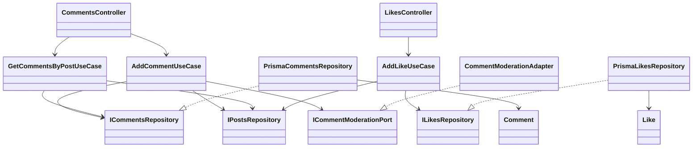

# Refactorización a Clean Architecture

## Problemas Identificados
Al analizar el código original, se detectaron las siguientes falencias relacionadas con el diseño de software y arquitectura:

1. **Alto Acoplamiento con el Framework y la Infraestructura:** El `PostsService` original estaba fuertemente acoplado a `PrismaService`. Mezclaba la lógica de negocio (como el mecanismo de estrategias de ranking del *feed*) con las consultas y el acceso a los datos.
2. **Falta de Límites Arquitectónicos Definidos:** Módulos que deberían ser adyacentes o separados (como `Likes` y `Comments`) inyectaban directamente dependencias de servicios implementados correspondientes a otras capas (`PostsService`). 
3. **Violación del Principio de Responsabilidad Única (SRP):** Un único servicio centralizado administraba demasiadas responsabilidades simultáneas: la creación de posts, la orquestación para llamar servicios externos de moderación y toda la lógica para manipular el feed.

---

## Solución Aplicada (Avance 1 - Módulo `Posts`)

Para esta primera fase, diseñamos una división vertical del trabajo y atacamos el **Core de Publicaciones** aplicando Clean Architecture. Se definieron las 4 capas base de este patrón:

- **Dominio (`domain/`)**: 
  - Se definieron y aislaron entidades puras de negocio: `Post` y `FeedPost`. Éstas no tienen anotaciones del framework ni importaciones de base de datos.
  - La lógica de ranking (Estrategias *Latest*, *MostLiked*, *MostCommented*, *Relevance*) fue convertida en código de negocio puro dentro de `feed-ranking.strategy.ts`.
- **Aplicación (`application/`)**:
  - **Casos de Uso (Use Cases):** Se dividió la funcionalidad del servicio monolítico en 3 casos de uso (`CreatePostUseCase`, `GetAllPostsUseCase`, `GetFeedUseCase`).
  - **Puertos (Ports):** Usando el **Principio de Inversión de Dependencias (DIP)**, se declararon interfaces base sobre cómo nuestra aplicación deberá conectarse al mundo externo: `IPostsRepository` y `IModerationPort`.
- **Infraestructura (`infrastructure/`)**:
  - `PrismaPostsRepository` implementa `IPostsRepository` empleando a Prisma para realizar persistencia y retornar las Entidades puras definidas en el dominio.
  - `ModerationAdapter` implementa `IModerationPort` para invocar al servicio aislado de moderación.
- **Presentación (`posts.controller.ts`)**: Su labor central ahora se reduce a inyectar únicamente Casos de Uso desde la capa de Aplicación y retornar los HTTP payloads correspondientes.

### Cambios Secundarios Transversales
Para preservar el correcto funcionamiento del resto de la aplicación, los módulos de funcionalidades sociales como `Likes` y `Comments` eliminaron su importación destructiva al viejo `PostsService`. A cambio de ello, ahora emplean *Tokens de Inyección* hacia `IPostsRepository`, permitiendo mantener un buen enrutamiento.

### Próximos pasos
El resto del equipo se encargará de realizar este mismo nivel de aislamiento para los Dominios restantes (`Likes`, `Comments`, `Moderation` y `Categories`).
---

## Solucion Aplicada (Avance 2 - `Comments` y `Likes`)

### Problemas Identificados
En los modulos de interaccion social se encontraron problemas similares a los del modulo `Posts`:

1. **Dependencia directa con Prisma:** `CommentsService` y `LikesService` dependian de `PrismaService`, por lo que la logica de aplicacion estaba mezclada con infraestructura.
2. **Reglas de negocio dentro de servicios acoplados:** La validacion de existencia del post, la moderacion de comentarios y los valores por defecto de likes estaban concentrados en servicios NestJS.
3. **Ausencia de puertos propios:** No existian interfaces para abstraer la persistencia de comentarios y likes, dificultando cambios de base de datos o pruebas unitarias aisladas.
4. **Controladores sin casos de uso:** Los controladores delegaban a servicios que hacian demasiadas cosas, en vez de orquestar casos de uso concretos.

### Solucion Implementada
Se refactorizaron `comments` y `likes` siguiendo las cuatro capas de Clean Architecture:

- **Dominio (`domain/`)**:
  - `Comment` y `Like` son entidades puras, sin dependencias de NestJS ni Prisma.
- **Aplicacion (`application/`)**:
  - `AddCommentUseCase`: valida que el post exista, modera el contenido y crea el comentario.
  - `GetCommentsByPostUseCase`: valida que el post exista y lista sus comentarios.
  - `AddLikeUseCase`: valida que el post exista, aplica valores por defecto (`reactionType = "like"`, `weight = 1`) y protege la regla de peso minimo.
  - `ICommentsRepository`, `ILikesRepository` e `ICommentModerationPort` definen los contratos que la aplicacion necesita.
- **Infraestructura (`infrastructure/`)**:
  - `PrismaCommentsRepository` y `PrismaLikesRepository` implementan los puertos usando Prisma.
  - `CommentModerationAdapter` adapta el servicio de moderacion existente al puerto requerido por comments.
- **Presentacion (`*.controller.ts`)**:
  - `CommentsController` y `LikesController` ahora invocan casos de uso directamente y mantienen los mismos contratos HTTP.

Los servicios `CommentsService` y `LikesService` quedaron como fachadas desacopladas, sin dependencia directa a `PrismaService`, para preservar compatibilidad si otro modulo los importa.

### Diagrama Resumido



### Codigo Resumido

```ts
export class AddLikeUseCase {
    async execute(data: { postId: string; reactionType?: string; weight?: number }) {
        const post = await this.postsRepository.findById(data.postId)
        if (!post) throw new NotFoundException("Post no encontrado")

        const weight = data.weight ?? 1
        if (weight < 1) throw new BadRequestException("El peso debe ser al menos 1")

        return this.likesRepository.create({
            postId: data.postId,
            reactionType: data.reactionType ?? "like",
            weight,
            source: "likes-module",
        })
    }
}
```
